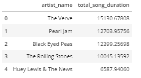
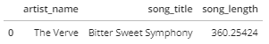

# Data Lake Project #
---

Sparkify wants to migrate to a data lake from a data warehouse as they have increased their user base and song database.
Currently they have a directory of JSON logs on user activity on their app and a directory of JSON metadata for the songs in the app.
My task is to create a S3 data lake by building an ETL pipeline using Spark to process the JSON logs into analytic tables for the analytics team to find insights on user activity.
---

## Project Files
---
### dl.cfg
    - Provides AWS credentials in order to run a Spark session

### etl.py
    - Creates a Spark session, extracts songs data and log data, transforms the data into songs, artists, users, and time dimension tables and a songplays fact table,
    then loads the transformed data into a S3 data lake for use by the Sparkify analytics team
    
### etl_test.ipynb
    - Jupyter notebook used to quickly test code as a substitute for running etl.py 
    
## How to Run Project
1. Enter AWS credentials into dl.cfg
2. Run etl.py as ```python3 etl.py``` in terminal
5. Run sample query to test data


## Sample Query
**These queries are not optimized and will take a while to run**
These two simple queries demonstrate that the ETL pipeline is successful and available for the analytics team to run queries.


